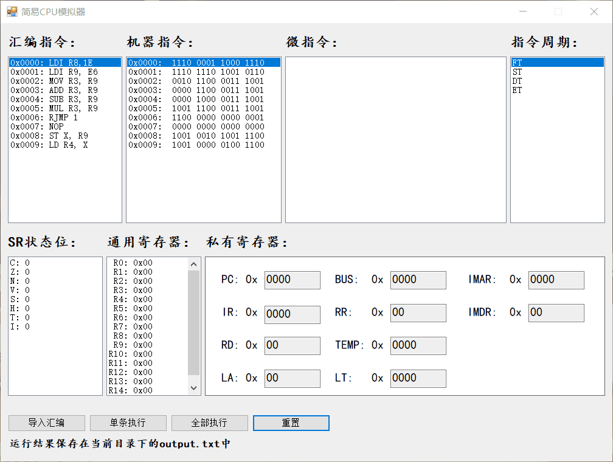

# 简易 CPU 模拟器

根据计算机组成与原理的课程设计要求编写的 cpu 模拟器，可以读取特定的汇编指令集文件，并以执行一条微指令为最小单位进行单步执行和全部执行。

> 示例程序在 [bin/Debug/Computer.exe](bin/Debug/Computer.exe)

> 示例汇编代码在 [bin/Debug/test.data](bin/Debug/test.data)

## 界面预览

## 课程设计要求

[任务书.md](任务书.md)

## 指导老师

于复兴
